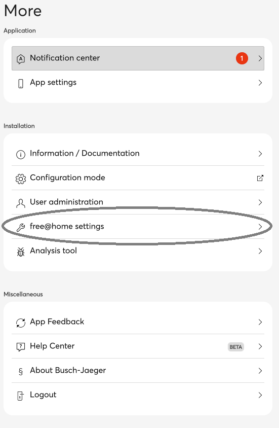
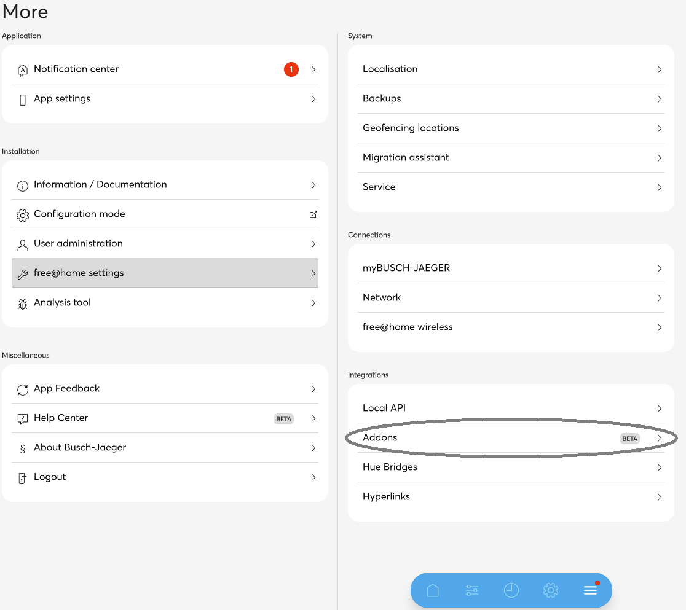
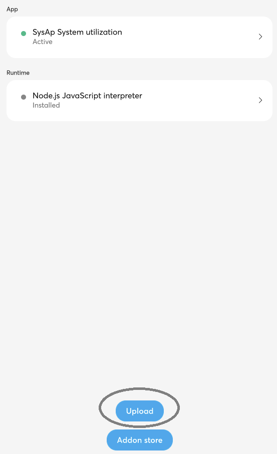
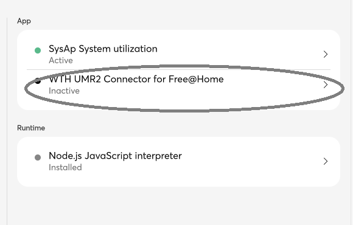
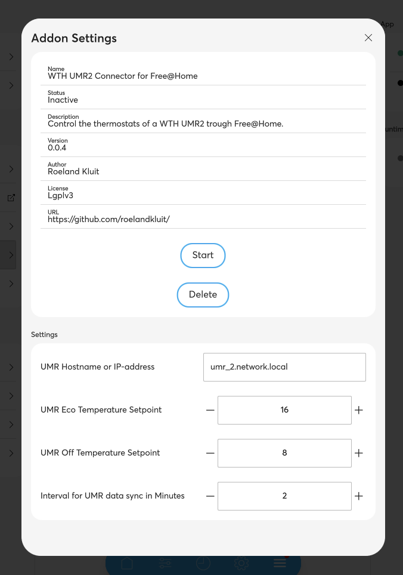
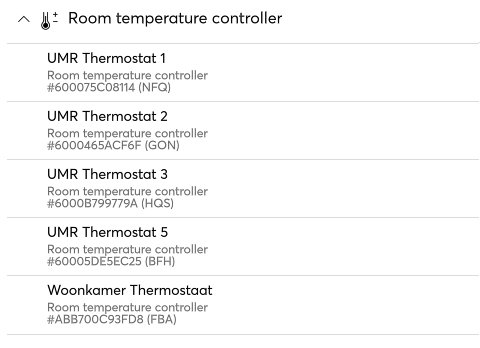

## About ##
Control the thermostats of a WTH UMR2 trough Free@Home. 
The UMR Busch Jeager connector Addon enables you to manage UMR2 bus thermostats trough Free@Home.

## Installation ##
To install the UMR addon to the Busch Jeager System Access point. 
 
- Download the latest release from: 
https://github.com/roelandkluit/FreeAtHome-WTH-UMR2-Connector/tree/master/SysAP%20Packages 
and store it on your system.

- Open the System Access point website and goto Free@Home settings  
 

- Open the addons  
 

- Select Upload  
 

- Select the file downloaded in step 1 and click OK 

- Once the upload and processing is complete, click the newly installed addon: 
 

- Configure the temperature and UMR hostname settings: 
 

- Click 'Start', the addon is activated. 
 

- New thermostat device are created for each UMR bus thermostat. 
 
